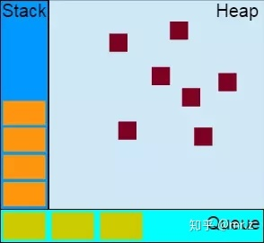
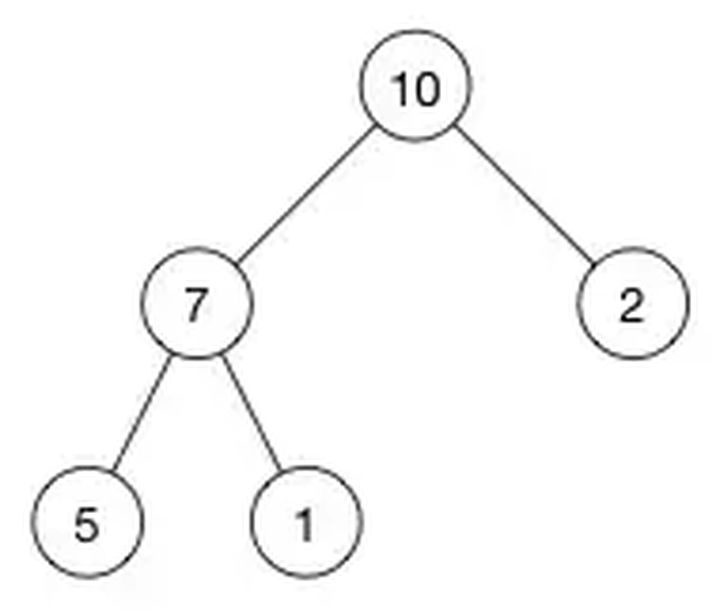
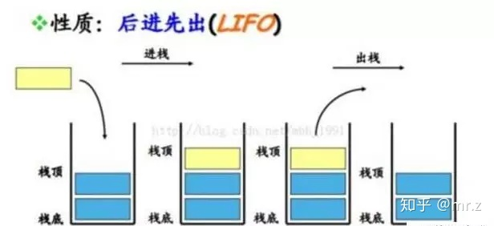
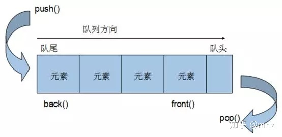
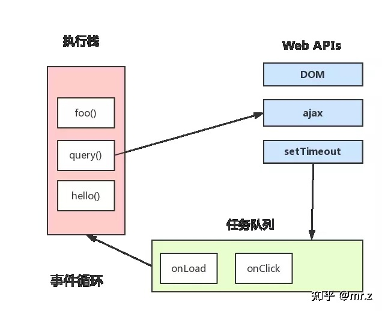
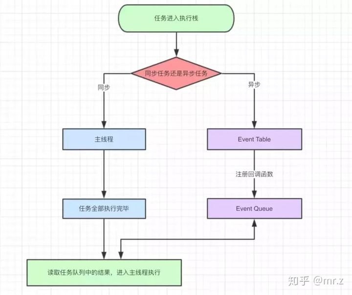
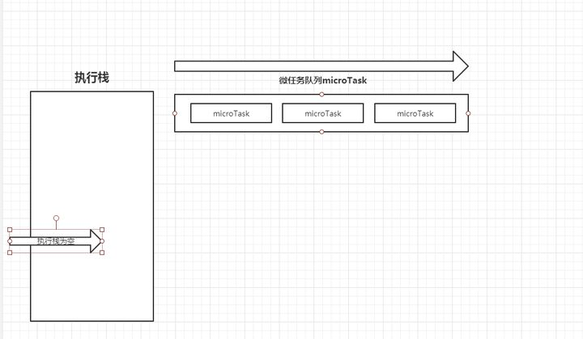

## Javascript 事件循环机制（Event Loop）

### 前言

Event Loop 即事件循环，是指浏览器或 Node 的一种解决 javascript 单线程运行时不会阻塞的一种机制，也就是我们经常使用异步的原理。

### 为什么要弄懂Event Loop

- 是要增加自己技术的深度，也就是懂得 Javascript 的运行机制。
- 现在在前端领域各种技术层出不穷，掌握底层原理，可以让自己以不变，应万变。
- 应对各大互联网公司的面试，懂其原理，题目任其发挥。

### 堆，栈、队列



### 堆（Heap）

**堆**是一种数据结构，是利用完全二叉树维护的一组数据，**堆**分为两种，一种为最大**堆**，一种为**最小堆**，将根节点**最大**的**堆**叫做**最大堆**或**大根堆**，根节点**最小**的**堆**叫做**最小堆**或**小根堆**。

**堆**是**线性数据结构**，相当于**一维数组**，有唯一后继。

如最大堆



### 栈（Stack）

**栈**在计算机科学中是限定仅在**表尾**进行**插入**或**删除**操作的线性表。**栈**是一种数据结构，它按照**后进先出**的原则存储数据，**先进入**的数据被压入**栈底**，**最后的数据**在**栈顶**，需要读数据的时候从**栈顶**开始**弹出数据**

**栈**是只能在**某一端插入**和**删除**的**特殊线性表**。




### 队列（Queue）

特殊之处在于它只允许在表的前端（`front`）进行**删除**操作，而在表的后端（`rear`）进行**插入**操作，和**栈**一样，**队列**是一种操作受限制的线性表。

进行**插入**操作的端称为**队尾**，进行**删除**操作的端称为**队头**。 队列中没有元素时，称为**空队列**。

**队列**的数据元素又称为**队列元素**。在队列中插入一个队列元素称为**入队**，从**队列**中**删除**一个队列元素称为**出队**。因为队列**只允许**在一端**插入**，在另一端**删除**，所以只有**最早**进入**队列**的元素**才能最先从队列中**删除，故队列又称为**先进先出**（`FIFO—first in first out`）



### EventLoop

在`JavaScript`中，任务被分为两种，一种宏任务（`MacroTask`）也叫`Task`，一种叫微任务（`MicroTask`）。

### MacroTask（宏任务）

`script`全部代码、`setTimeout`、`setInterval`、`setImmediate`（浏览器暂时不支持，只有IE10支持，具体可见`MDN`）、`I/O`、`UI Rendering`。

### MicroTask（微任务）

Process.nextTick（Node独有）`、`Promise`、`Object.observe(废弃)`、`MutationObserver

### 浏览器中的Event Loop

`Javascript` 有一个 `main thread` 主线程和 `call-stack` 调用栈(执行栈)，所有的任务都会被放到调用栈等待主线程执行。

### JS 调用栈

JS调用栈采用的是后进先出的规则，当函数执行的时候，会被添加到栈的顶部，当执行栈执行完成后，就会从栈顶移出，直到栈内被清空。

### 同步任务和异步任务

`Javascript`单线程任务被分为**同步任务**和**异步任务**，同步任务会在调用栈中按照顺序等待主线程依次执行，异步任务会在异步任务有了结果后，将注册的回调函数放入任务队列中等待主线程空闲的时候（调用栈被清空），被读取到栈内等待主线程的执行。



任务队列`Task Queue`，即队列，是一种先进先出的一种数据结构。



### 事件循环的进程模型

- 选择当前要执行的任务队列，选择任务队列中最先进入的任务，如果任务队列为空即`null`，则执行跳转到微任务（`MicroTask`）的执行步骤。
- 将事件循环中的任务设置为已选择任务。
- 执行任务。
- 将事件循环中当前运行任务设置为null。
- 将已经运行完成的任务从任务队列中删除。
- microtasks步骤：进入microtask检查点。
- 更新界面渲染。
- 返回第一步。

### 执行进入microtask检查点时，用户代理会执行以下步骤：

- 设置microtask检查点标志为true。
- 当事件循环`microtask`执行不为空时：选择一个最先进入的`microtask`队列的`microtask`，将事件循环的`microtask`设置为已选择的`microtask`，运行`microtask`，将已经执行完成的`microtask`为`null`，移出`microtask`中的`microtask`。
- 清理IndexDB事务
- 设置进入microtask检查点的标志为false。



执行栈在执行完**同步任务**后，查看**执行栈**是否为空，如果执行栈为空，就会去执行`Task`（宏任务），每次**宏任务**执行完毕后，检查**微任务**(`microTask`)队列是否为空，如果不为空的话，会按照**先入先**出的规则全部执行完**微任务**(`microTask`)后，设置**微任务**(`microTask`)队列为`null`，然后再执行**宏任务**，如此循环。

### 举个例子

```js
console.log('script start');

setTimeout(function() {
  console.log('setTimeout');
}, 0);

Promise.resolve().then(function() {
  console.log('promise1');
}).then(function() {
  console.log('promise2');
});

console.log('script end');
```

### 第一次执行

```js
Tasks：run script、 setTimeout callback

Microtasks：Promise then	

JS stack: script	
Log: script start、script end。
```

执行同步代码，将宏任务（`Tasks`）和微任务(`Microtasks`)划分到各自队列中。

### 第二次执行

```js
Tasks：run script、 setTimeout callback

Microtasks：Promise2 then	

JS stack: Promise2 callback	
Log: script start、script end、promise1、promise2
```

执行宏任务后，检测到微任务(`Microtasks`)队列中不为空，执行`Promise1`，执行完成`Promise1`后，调用`Promise2.then`，放入微任务(`Microtasks`)队列中，再执行`Promise2.then`。

### 第三次执行

```js
Tasks：setTimeout callback

Microtasks：	

JS stack: setTimeout callback
Log: script start、script end、promise1、promise2、setTimeout
```

当微任务(`Microtasks`)队列中为空时，执行宏任务（`Tasks`），执行`setTimeout callback`，打印日志。

### 第四次执行

```js
Tasks：setTimeout callback

Microtasks：	

JS stack: 
Log: script start、script end、promise1、promise2、setTimeout
```

清空**Tasks**队列和`JS stack`。

